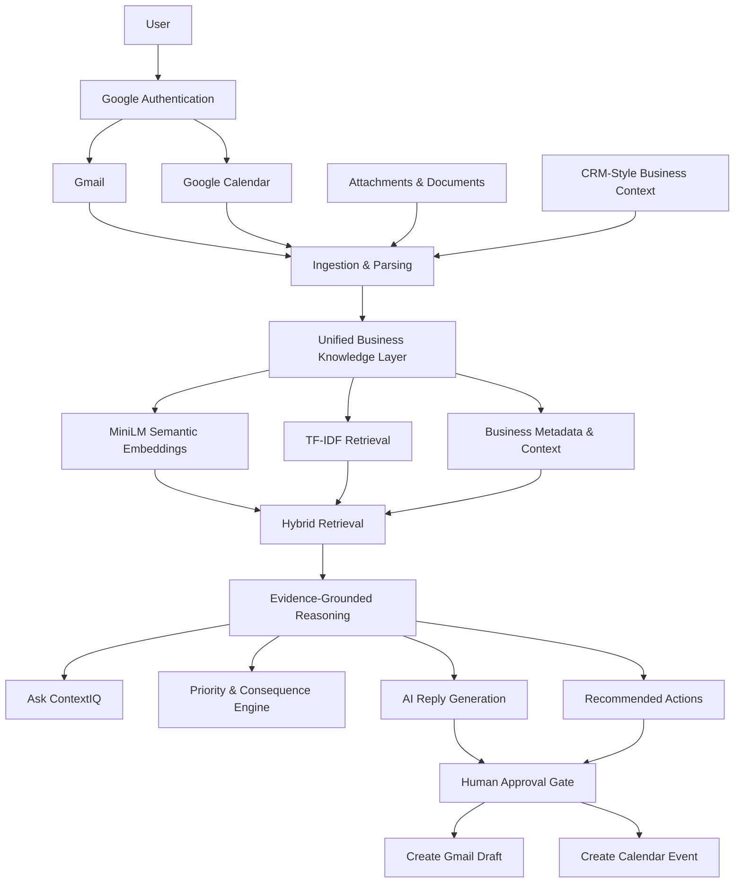

<h1 align="center">
ContextIQ
</h1>

<p align="center">
  <strong>AI-Powered Business Decision Intelligence</strong>
</p>

<p align="center">
  An evidence-grounded AI copilot that transforms Gmail, Calendar, documents, and business context
  into prioritized insights, contextual answers, and human-approved actions.
</p>

<p align="center">
  
  
  
  
  
  
  
  
  
</p>

---

## Overview

**ContextIQ** is an AI-powered business intelligence and decision-support system designed to go beyond traditional email summarization.

Modern work is fragmented across emails, meetings, documents, customer information, commitments, and follow-up tasks. Important business context is often distributed across multiple sources, forcing users to manually reconstruct what happened, what matters, and what should happen next.

ContextIQ creates a unified intelligence layer over this information.

It connects:

- Gmail conversations
- Google Calendar events
- attachments and documents
- contacts and companies
- CRM-style account and opportunity context
- detected commitments and follow-ups

and turns them into an evidence-backed decision workflow:

> **Understand → Retrieve → Connect → Reason → Explain → Approve → Act → Track**

Instead of simply generating summaries, ContextIQ identifies important business signals, retrieves relevant historical context, answers questions using supporting evidence, recommends actions, and executes sensitive actions only after explicit user approval.

---

## Why ContextIQ?

Most AI email assistants focus on one isolated task:

- summarize an email,
- generate a reply,
- classify a message,
- or search an inbox.

ContextIQ approaches the problem differently.

A single customer email may be related to:

- earlier conversations,
- a pending opportunity,
- previous commitments,
- an upcoming meeting,
- an attached proposal,
- a customer account,
- or an unresolved business risk.

ContextIQ connects these signals before generating a recommendation.

The result is not just:

> **"What does this email say?"**

but rather:

> **"What does this mean for the business, what evidence supports that conclusion, and what should I do next?"**

---

## Key Features

### Intelligent Business Inbox

ContextIQ analyzes incoming communication and surfaces business-relevant information such as:

- message intent
- priority
- commitments and requests
- due-date signals
- related account context
- previous conversation history
- business consequence and risk
- relevant meetings and documents

This turns the inbox into a prioritized decision surface instead of a chronological message list.

---

### Hybrid Retrieval-Augmented Generation

ContextIQ implements a **hybrid RAG pipeline** combining semantic and lexical retrieval.

The retrieval layer uses:

- **SentenceTransformers MiniLM embeddings** for semantic similarity
- **TF-IDF retrieval** for exact lexical and keyword relevance
- contextual metadata for business-aware filtering
- evidence aggregation across multiple information sources

This combination helps retrieve both:

- conceptually related information, and
- exact names, terms, customers, topics, and identifiers.

---

### Unified Business Memory

ContextIQ builds searchable context across multiple business entities including:

- emails
- Gmail threads
- attachments
- contacts
- companies
- opportunities
- calendar events
- commitments
- account context

Instead of treating each source independently, ContextIQ creates a shared business knowledge layer that can be queried during reasoning.

---

### Ask ContextIQ

Users can ask natural-language business questions such as:

> Which customer needs my attention first and why?

> What commitments are still unresolved?

> What is the history behind this customer conversation?

> Which upcoming meeting is connected to an active opportunity?

> What should I prioritize today?

ContextIQ retrieves relevant information first and then generates an answer from the retrieved evidence.

The system is designed to reduce unsupported LLM responses by grounding reasoning in business data available inside the workspace.

---

### Evidence-Grounded AI Reasoning

ContextIQ does not treat an LLM as the source of truth.

The pipeline follows:

```text
User Question
      │
      ▼
Business Context Retrieval
      │
      ├── Semantic Embeddings
      ├── TF-IDF Retrieval
      ├── Email History
      ├── Attachments
      ├── CRM Context
      ├── Calendar Events
      └── Commitments
      │
      ▼
Evidence Selection
      │
      ▼
Grounded AI Reasoning
      │
      ▼
Answer + Supporting Evidence
```

Gemini can be used for generative reasoning, while the application preserves a local fallback path when external generative AI is unavailable.

---

### Commitment Intelligence

ContextIQ detects actionable language in communication, including:

- requests
- promises
- expected responses
- deadlines
- meeting commitments
- follow-up requirements

These commitments are surfaced in the Command Center so important obligations do not remain buried inside email threads.

---

### Human-Approved AI Actions

ContextIQ follows a **human-in-the-loop** design for actions that affect external systems.

AI can recommend and prepare actions such as:

- generating a reply
- creating a Gmail draft
- scheduling a Google Calendar event

but execution requires explicit user approval.

For email workflows, ContextIQ creates a **Gmail draft rather than automatically sending the message**.

This separates:

```text
AI Recommendation
       ↓
User Review
       ↓
Explicit Approval
       ↓
External Action
```

and keeps the user in control of consequential operations.

---

## System Architecture



---

## AI / ML Pipeline

The AI layer is designed around **retrieval, context fusion, grounded generation, and explainability** rather than relying only on prompt engineering.

### 1. Data ingestion

Business information is collected from multiple sources and normalized into searchable records.

### 2. Text preprocessing

Content from messages, documents, CRM-style records, and events is prepared for retrieval.

### 3. Semantic representation

Text is encoded using:

```text
SentenceTransformers
└── all-MiniLM-L6-v2
```

to create dense semantic representations.

### 4. Lexical retrieval

TF-IDF captures strong keyword and exact-term relationships that embedding-only retrieval can sometimes miss.

### 5. Hybrid retrieval

Semantic and lexical signals are combined to retrieve the most relevant business context.

```text
Semantic Similarity
        +
TF-IDF Relevance
        +
Business Context
        ↓
Ranked Evidence
```

### 6. Evidence-grounded generation

Retrieved evidence is supplied to the reasoning layer before generating an answer or recommendation.

### 7. Action generation

Where appropriate, ContextIQ proposes a business action.

### 8. Human approval

External actions are executed only after explicit user approval.

---

## End-to-End Workflow

A typical ContextIQ workflow looks like this:

```text
Customer Email Arrives
        │
        ▼
Intent / Priority Analysis
        │
        ▼
Retrieve Related Business Context
        │
        ├── Previous Emails
        ├── Account Information
        ├── Opportunity Context
        ├── Attachments
        ├── Calendar Events
        └── Commitments
        │
        ▼
Hybrid RAG
        │
        ▼
Evidence-Grounded Reasoning
        │
        ▼
Risk / Priority / Recommendation
        │
        ▼
Suggested Reply or Calendar Action
        │
        ▼
Human Approval
        │
        ▼
Gmail Draft / Calendar Event
```

---

## Application Modules

### Command Center

Provides a high-level operational view of:

- important business activity
- attention-required items
- open commitments
- recommended actions
- pending approvals
- AI-generated contextual briefs

---

### Intelligent Inbox

Enriches email conversations with:

- intent
- priority
- contextual history
- related business entities
- consequence signals
- relevant commitments
- retrieved evidence

---

### Ask ContextIQ

Natural-language interface for asking questions across the unified business knowledge base.

---

### Action Center

Central location for reviewing and approving AI-proposed actions before they are executed.

---

### Context Views

Provides structured views of accounts, people, opportunities, related communication, and supporting evidence.

---

## Technology Stack

| Layer | Technologies |
|---|---|
| Programming | Python 3.12+ |
| Frontend | Streamlit |
| Backend | FastAPI, Uvicorn |
| Database | SQLite, SQLAlchemy |
| Semantic Retrieval | SentenceTransformers, MiniLM |
| Lexical Retrieval | Scikit-learn, TF-IDF |
| Generative AI | Google Gemini |
| Authentication | Google OAuth 2.0 |
| Integrations | Gmail API, Google Calendar API |
| Document Processing | PyPDF, python-docx |
| Security | Cryptography, signed sessions |
| Testing | Pytest |
| HTTP | Requests, HTTPX |

---

## Repository Structure

```text
ContextIQ/
│
├── ai/                     # AI, retrieval and reasoning components
├── backend/
│   └── app/                # FastAPI backend and business logic
│
├── frontend/               # Streamlit application
├── data/                   # Local application data
├── docs/                   # Setup and demo documentation
├── scripts/                # Development and release scripts
├── tests/                  # Automated test suite
├── .streamlit/             # Streamlit configuration
│
├── .env.example            # Environment configuration template
├── .gitignore
├── requirements.txt
├── streamlit_app.py
└── README.md
```

---

## Getting Started

### Requirements

Before running ContextIQ, ensure you have:

- Python **3.12+**
- Git
- a Google account
- a Google Cloud OAuth Web Client
- Gmail API enabled
- Google Calendar API enabled

A Gemini API key is optional.

---

### 1. Clone the Repository

```bash
git clone https://github.com/027Sakshi/ContextIQ.git
cd ContextIQ
```

---

### 2. Create a Virtual Environment

#### Windows

```powershell
py -m venv .venv
.\.venv\Scripts\Activate.ps1
```

#### macOS / Linux

```bash
python3 -m venv .venv
source .venv/bin/activate
```

---

### 3. Install Dependencies

```bash
pip install -r requirements.txt
```

---

### 4. Configure Environment Variables

Copy the example configuration:

#### Windows

```powershell
Copy-Item .env.example .env
```

#### macOS / Linux

```bash
cp .env.example .env
```

Important configuration includes:

```env
CONTEXTIQ_ENV=development
CONTEXTIQ_API_URL=http://127.0.0.1:8000

GEMINI_API_KEY=
GEMINI_MODEL=gemini-3.8-flash

GOOGLE_OAUTH_REDIRECT_URI=http://localhost:8501

CONTEXTIQ_SESSION_SECRET=replace-with-a-long-random-secret
CONTEXTIQ_SESSION_TTL_SECONDS=43200
```

Gemini is optional. ContextIQ preserves local intelligence and fallback behavior when the external generative model is not configured.

---

## Google OAuth Setup

ContextIQ uses Google authentication for identity and workspace integrations.

### Google Cloud Configuration

1. Create or select a project in Google Cloud Console.
2. Enable the **Gmail API**.
3. Enable the **Google Calendar API**.
4. Configure the OAuth consent screen.
5. Create an **OAuth 2.0 Client ID** for a Web Application.
6. Add the following redirect URI:

```text
http://localhost:8501
```

7. Download the OAuth client JSON.
8. Save it as:

```text
credentials/google_oauth_client.json
```

Do **not** commit this file.

The detailed guide is available at:

```text
docs/GOOGLE_OAUTH_SETUP.md
```

---

## Running ContextIQ

### Recommended Development Start

On Windows:

```powershell
.\scripts\run_dev.ps1
```

This starts:

```text
FastAPI API
http://127.0.0.1:8000
```

and:

```text
Streamlit Application
http://localhost:8501
```

---

### Manual Start

Start the backend:

```bash
python -m uvicorn backend.app.main:app --host 127.0.0.1 --port 8000
```

Then start the frontend:

```bash
streamlit run frontend/app.py --server.port 8501
```

Open:

```text
http://localhost:8501
```

---

## Demo Data

A safe local demo workspace can be generated using the included seed scripts.

```powershell
$env:DEMO_USER_EMAIL="your-google-account@gmail.com"

python -m backend.app.scripts.seed_data
python -m backend.app.scripts.seed_calendar
```

This is useful for demonstrating ContextIQ without depending entirely on live business data.

---

## Testing

Run the automated test suite:

```bash
python -m pytest -q
```

Check Python compilation:

```bash
python -m compileall -q backend frontend ai tests
```

For the complete release validation on Windows:

```powershell
.\scripts\check_release.ps1
```

The release check validates:

- dependency integrity
- Python compilation
- automated tests
- secret and runtime-file protection
- production AI client configuration
- Git diff integrity
- clean repository state

---

## Security & Privacy

ContextIQ is intentionally designed around user control and data isolation.

### Authentication

A single Google identity is used to associate the authenticated ContextIQ workspace with Gmail and Calendar access.

### Per-User Data Isolation

Business records are scoped to the authenticated user.

### Encrypted OAuth Tokens

Stored Google refresh tokens are encrypted before being persisted locally.

### Secret Protection

Sensitive files such as:

```text
.env
OAuth credentials
refresh tokens
local databases
imported attachments
```

are excluded from version control.

### Human Approval

AI-generated actions are never treated as automatically authorized actions.

High-impact operations require explicit approval.

### Safe Email Automation

ContextIQ can create Gmail drafts but does not automatically send emails.

---

## Design Principles

ContextIQ was built around several core principles.

### Evidence Before Generation

Retrieve relevant business information before asking the generative model to reason.

### Context Over Isolated Messages

Business decisions should consider previous conversations, people, documents, opportunities, meetings, and commitments.

### Hybrid Retrieval

Semantic search and lexical retrieval solve different retrieval problems and are stronger when used together.

### Explainability

Important recommendations should expose the information that influenced them.

### Human Control

AI should assist decision-making without silently performing consequential actions.

### Graceful AI Fallback

Core retrieval, scoring, evidence handling, and workflow intelligence should not completely depend on an external LLM.

---

## What Makes ContextIQ Different?

ContextIQ is not simply:

```text
Email → LLM → Summary
```

Instead, it implements:

```text
                    ┌── Email History
                    ├── Attachments
                    ├── Calendar
Incoming Signal ────┼── Contacts
                    ├── Accounts
                    ├── Opportunities
                    └── Commitments
                           │
                           ▼
                    Hybrid Retrieval
                           │
                           ▼
                    Ranked Evidence
                           │
                           ▼
                  Contextual Reasoning
                           │
                           ▼
                 Explainable Decision
                           │
                           ▼
                    Human Approval
                           │
                           ▼
                       Action
```

The project therefore combines **AI/ML, information retrieval, RAG, backend engineering, API integration, authentication, data modeling, and human-centered AI design** in one end-to-end system.

---

## Example Use Case

Consider a customer who emails asking about a delayed proposal and requests a meeting next week.

A traditional assistant may summarize the message.

ContextIQ can instead:

1. identify the request and urgency,
2. retrieve the customer's previous email history,
3. locate related opportunity and account context,
4. identify existing commitments,
5. inspect relevant upcoming calendar events,
6. retrieve supporting documents,
7. generate an evidence-backed recommendation,
8. draft an appropriate response,
9. suggest a meeting,
10. wait for user approval,
11. create the Gmail draft and Calendar event.

This demonstrates the core objective of ContextIQ:

> **Turn fragmented communication into contextual, explainable, and actionable business intelligence.**

---

## Current Capabilities

- [x] Google account authentication
- [x] Gmail integration
- [x] Google Calendar integration
- [x] Gmail thread-aware context
- [x] Attachment ingestion
- [x] CRM-style business context
- [x] MiniLM semantic embeddings
- [x] TF-IDF lexical retrieval
- [x] Hybrid RAG
- [x] Evidence-grounded Q&A
- [x] Commitment detection
- [x] Business priority and consequence analysis
- [x] AI reply generation
- [x] Human approval workflow
- [x] Gmail draft creation
- [x] Calendar event creation
- [x] Optional Gemini integration
- [x] Local AI fallback path
- [x] Per-user token encryption
- [x] Automated tests and release checks

---

## Future Improvements

Potential extensions include:

- vector database support for larger workspaces
- improved long-term organizational memory
- additional enterprise data connectors
- advanced reranking models
- configurable retrieval strategies
- richer business relationship graphs
- improved temporal reasoning
- automated evaluation of retrieval quality
- production deployment and observability
- role-based access control for team environments

---

## Project Focus

ContextIQ demonstrates practical experience across:

- Artificial Intelligence
- Machine Learning
- Retrieval-Augmented Generation
- Semantic Search
- Embeddings
- Natural Language Processing
- Generative AI
- Information Retrieval
- Python Backend Development
- REST APIs
- OAuth Authentication
- Secure AI Workflows
- Human-in-the-Loop AI
- Full-Stack AI Application Development

---

## Documentation

Additional project documentation is available under:

```text
docs/
```

Including:

- `GOOGLE_OAUTH_SETUP.md` — Google authentication and API configuration
- `HACKATHON_DEMO.md` — recommended project demonstration flow

---

## Author

**Sakshi Giglani**

[GitHub](https://github.com/027Sakshi) •
[LinkedIn](https://www.linkedin.com/in/sakshi-giglani/)

---

<p align="center">
  <strong>ContextIQ</strong><br>
  Turning business communication into evidence-backed decisions and controlled action.
</p>
