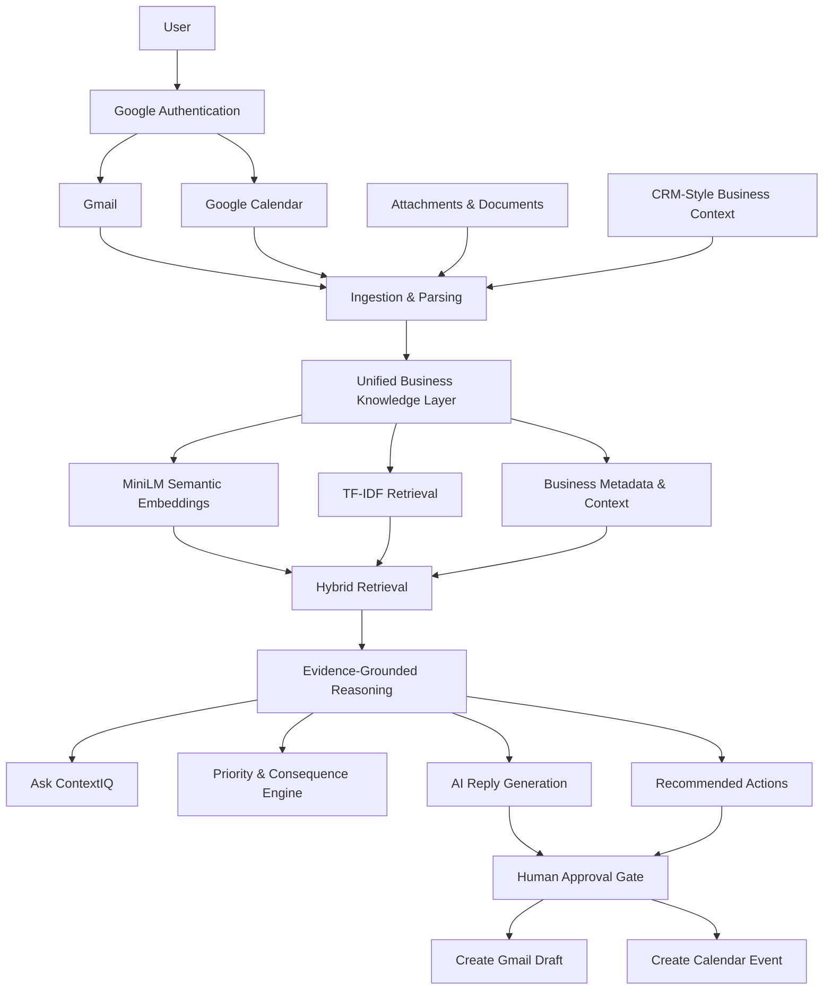

<h1 align="center">
ContextIQ
</h1>

<p align="center">
  <strong>AI-Powered Business Decision Intelligence</strong>
</p>

<p align="center">
  An evidence-grounded AI copilot that transforms Gmail, Calendar, documents, and business context
  into prioritized insights, contextual answers, and human-approved actions.
</p>

<p align="center">
  
  
  
  
  
  
  
  
  
</p>

---

## Overview

**ContextIQ** is an AI-powered business intelligence and decision-support system designed to go beyond traditional email summarization.

Modern work is fragmented across emails, meetings, documents, customer information, commitments, and follow-up tasks. Important business context is often distributed across multiple sources, forcing users to manually reconstruct what happened, what matters, and what should happen next.

ContextIQ creates a unified intelligence layer over this information.

It connects:

- Gmail conversations
- Google Calendar events
- attachments and documents
- contacts and companies
- CRM-style account and opportunity context
- detected commitments and follow-ups

and turns them into an evidence-backed decision workflow:

> **Understand → Retrieve → Connect → Reason → Explain → Approve → Act → Track**

Instead of simply generating summaries, ContextIQ identifies important business signals, retrieves relevant historical context, answers questions using supporting evidence, recommends actions, and executes sensitive actions only after explicit user approval.

---

## Why ContextIQ?

Most AI email assistants focus on one isolated task:

- summarize an email,
- generate a reply,
- classify a message,
- or search an inbox.

ContextIQ approaches the problem differently.

A single customer email may be related to:

- earlier conversations,
- a pending opportunity,
- previous commitments,
- an upcoming meeting,
- an attached proposal,
- a customer account,
- or an unresolved business risk.

ContextIQ connects these signals before generating a recommendation.

The result is not just:

> **"What does this email say?"**

but rather:

> **"What does this mean for the business, what evidence supports that conclusion, and what should I do next?"**

---

## Key Features

### Intelligent Business Inbox

ContextIQ analyzes incoming communication and surfaces business-relevant information such as:

- message intent
- priority
- commitments and requests
- due-date signals
- related account context
- previous conversation history
- business consequence and risk
- relevant meetings and documents

This turns the inbox into a prioritized decision surface instead of a chronological message list.

---

### Hybrid Retrieval-Augmented Generation

ContextIQ implements a **hybrid RAG pipeline** combining semantic and lexical retrieval.

The retrieval layer uses:

- **SentenceTransformers MiniLM embeddings** for semantic similarity
- **TF-IDF retrieval** for exact lexical and keyword relevance
- contextual metadata for business-aware filtering
- evidence aggregation across multiple information sources

This combination helps retrieve both:

- conceptually related information, and
- exact names, terms, customers, topics, and identifiers.

---

### Unified Business Memory

ContextIQ builds searchable context across multiple business entities including:

- emails
- Gmail threads
- attachments
- contacts
- companies
- opportunities
- calendar events
- commitments
- account context

Instead of treating each source independently, ContextIQ creates a shared business knowledge layer that can be queried during reasoning.

---

### Ask ContextIQ

Users can ask natural-language business questions such as:

> Which customer needs my attention first and why?

> What commitments are still unresolved?

> What is the history behind this customer conversation?

> Which upcoming meeting is connected to an active opportunity?

> What should I prioritize today?

ContextIQ retrieves relevant information first and then generates an answer from the retrieved evidence.

The system is designed to reduce unsupported LLM responses by grounding reasoning in business data available inside the workspace.

---

### Evidence-Grounded AI Reasoning

ContextIQ does not treat an LLM as the source of truth.

The pipeline follows:

```text
User Question
      │
      ▼
Business Context Retrieval
      │
      ├── Semantic Embeddings
      ├── TF-IDF Retrieval
      ├── Email History
      ├── Attachments
      ├── CRM Context
      ├── Calendar Events
      └── Commitments
      │
      ▼
Evidence Selection
      │
      ▼
Grounded AI Reasoning
      │
      ▼
Answer + Supporting Evidence
```

Gemini can be used for generative reasoning, while the application preserves a local fallback path when external generative AI is unavailable.

---

### Commitment Intelligence

ContextIQ detects actionable language in communication, including:

- requests
- promises
- expected responses
- deadlines
- meeting commitments
- follow-up requirements

These commitments are surfaced in the Command Center so important obligations do not remain buried inside email threads.

---

### Human-Approved AI Actions

ContextIQ follows a **human-in-the-loop** design for actions that affect external systems.

AI can recommend and prepare actions such as:

- generating a reply
- creating a Gmail draft
- scheduling a Google Calendar event

but execution requires explicit user approval.

For email workflows, ContextIQ creates a **Gmail draft rather than automatically sending the message**.

This separates:

```text
AI Recommendation
       ↓
User Review
       ↓
Explicit Approval
       ↓
External Action
```

and keeps the user in control of consequential operations.

---

## System Architecture



---

## AI/ML Highlights

ContextIQ combines **semantic retrieval, lexical search, contextual data fusion, and grounded LLM reasoning** to build an AI system that can understand business context rather than process each message independently.

### Hybrid RAG Pipeline

The retrieval layer combines two complementary approaches:

- **MiniLM Embeddings** — captures semantic similarity between queries and business content.
- **TF-IDF Retrieval** — preserves exact keywords, names, terms, and lexical relevance.
- **Context Fusion** — connects retrieved information across emails, documents, meetings, contacts, and business records.
- **Evidence Grounding** — passes relevant retrieved context to the reasoning layer before generating a response.

```text
                 User Query
                     │
                     ▼
          ┌─────────────────────┐
          │   Query Processing  │
          └──────────┬──────────┘
                     │
          ┌──────────┴──────────┐
          ▼                     ▼
   MiniLM Embeddings       TF-IDF Search
   Semantic Retrieval     Lexical Retrieval
          │                     │
          └──────────┬──────────┘
                     ▼
             Hybrid Ranking
                     │
                     ▼
          Contextual Evidence
                     │
                     ▼
          Grounded AI Reasoning
                     │
                     ▼
       Answer / Recommendation
```

---

## Core AI Capabilities

| Capability | Implementation |
|---|---|
| **Semantic Search** | SentenceTransformer MiniLM embeddings for contextual similarity |
| **Hybrid Retrieval** | Dense embeddings combined with TF-IDF lexical retrieval |
| **Retrieval-Augmented Generation** | Relevant business evidence retrieved before LLM reasoning |
| **Context Fusion** | Connects Gmail, Calendar, documents, contacts, and business records |
| **Grounded Q&A** | Generates answers using retrieved evidence instead of isolated prompting |
| **Commitment Detection** | Identifies requests, follow-ups, promises, and actionable communication |
| **Priority Intelligence** | Surfaces important conversations and business consequences |
| **AI Response Generation** | Generates contextual replies using retrieved conversation history |
| **Human-in-the-Loop AI** | Requires approval before consequential external actions |

---

## Context-Aware Intelligence

A major focus of ContextIQ is moving beyond:

```text
Email → Prompt → LLM Response
```

and instead building:

```text
Email
  │
  ├── Previous Conversations
  ├── Calendar Events
  ├── Documents
  ├── Contacts
  ├── Business Context
  └── Commitments
           │
           ▼
      Hybrid Retrieval
           │
           ▼
      Relevant Evidence
           │
           ▼
      AI Reasoning
           │
           ▼
   Decision + Recommended Action
```

This allows the system to answer questions using the **surrounding business context**, not only the currently selected message.

---

## Example Intelligence Flow

Suppose a customer sends an email asking for an update on a proposal.

ContextIQ can:

1. Understand the incoming message and identify its intent.
2. Retrieve previous conversations with the customer.
3. Find related documents, meetings, and business context.
4. Detect previous commitments or unresolved follow-ups.
5. Rank the most relevant evidence using hybrid retrieval.
6. Generate an evidence-grounded recommendation.
7. Prepare a contextual response or suggested action.
8. Require user approval before creating an external action.

This demonstrates the core idea behind ContextIQ:

> **Retrieve first. Reason with context. Act only with approval.**

---

## Human-in-the-Loop AI

ContextIQ separates **AI reasoning** from **action execution**.

```text
AI Recommendation
        │
        ▼
Generated Action
        │
        ▼
Human Review
        │
        ▼
Explicit Approval
        │
        ▼
External Action
```

For example, ContextIQ can generate an email response, but instead of automatically sending it, the system can create a **Gmail draft for user review**.

This keeps AI useful while maintaining user control over consequential actions.

---

## Technology Stack

| Area | Technologies |
|---|---|
| **Language** | Python |
| **AI / ML** | SentenceTransformers, MiniLM, Scikit-learn |
| **Retrieval** | Semantic Embeddings, TF-IDF, Cosine Similarity, Hybrid RAG |
| **Generative AI** | Google Gemini |
| **Backend** | FastAPI |
| **Frontend** | Streamlit |
| **Database** | SQLite, SQLAlchemy |
| **Integrations** | Gmail API, Google Calendar API |
| **Authentication** | Google OAuth 2.0 |
| **Document Processing** | PyPDF, python-docx |
| **Testing** | Pytest |

---

## Project Structure

```text
ContextIQ/
│
├── ai/                     # Retrieval, embeddings and AI reasoning
├── backend/
│   └── app/                # FastAPI APIs and business logic
├── frontend/               # Streamlit interface
├── data/                   # Application data
├── docs/                   # Project documentation
├── scripts/                # Development utilities
├── tests/                  # Automated tests
│
├── .env.example
├── requirements.txt
├── streamlit_app.py
└── README.md
```

---

## Quick Start

### 1. Clone the repository

```bash
git clone https://github.com/027Sakshi/ContextIQ.git
cd ContextIQ
```

### 2. Create a virtual environment

```bash
python -m venv .venv
```

**Windows**

```powershell
.\.venv\Scripts\Activate.ps1
```

**Linux / macOS**

```bash
source .venv/bin/activate
```

### 3. Install dependencies

```bash
pip install -r requirements.txt
```

### 4. Configure environment variables

```bash
cp .env.example .env
```

Configure the required Google OAuth credentials and optional Gemini API key inside `.env`.

### 5. Start the application

Backend:

```bash
python -m uvicorn backend.app.main:app --host 127.0.0.1 --port 8000
```

Frontend:

```bash
streamlit run frontend/app.py --server.port 8501
```

Open:

```text
http://localhost:8501
```

---

## Key Engineering Principles

- **Retrieval before generation** to reduce unsupported LLM responses.
- **Hybrid search** instead of relying only on vector similarity.
- **Context fusion** across multiple business information sources.
- **Evidence-backed reasoning** for explainable AI outputs.
- **Human approval gates** before external actions.
- **User-scoped data and authentication** for safer multi-user workflows.
- **Modular AI and backend architecture** for future model and retrieval upgrades.

---

## Future Scope

- Vector database support for larger knowledge bases.
- Learned reranking for improved retrieval quality.
- Long-term organizational memory and temporal reasoning.
- Additional enterprise connectors and business data sources.
- Retrieval and generation evaluation pipelines.
- Production observability and scalable deployment.

---

## Author

**Sakshi Giglani**

[GitHub](https://github.com/027Sakshi) •
[LinkedIn](https://www.linkedin.com/in/sakshi-giglani/)

---

<p align="center">
  <strong>ContextIQ</strong><br>
  Turning fragmented business context into evidence-grounded intelligence.
</p>
